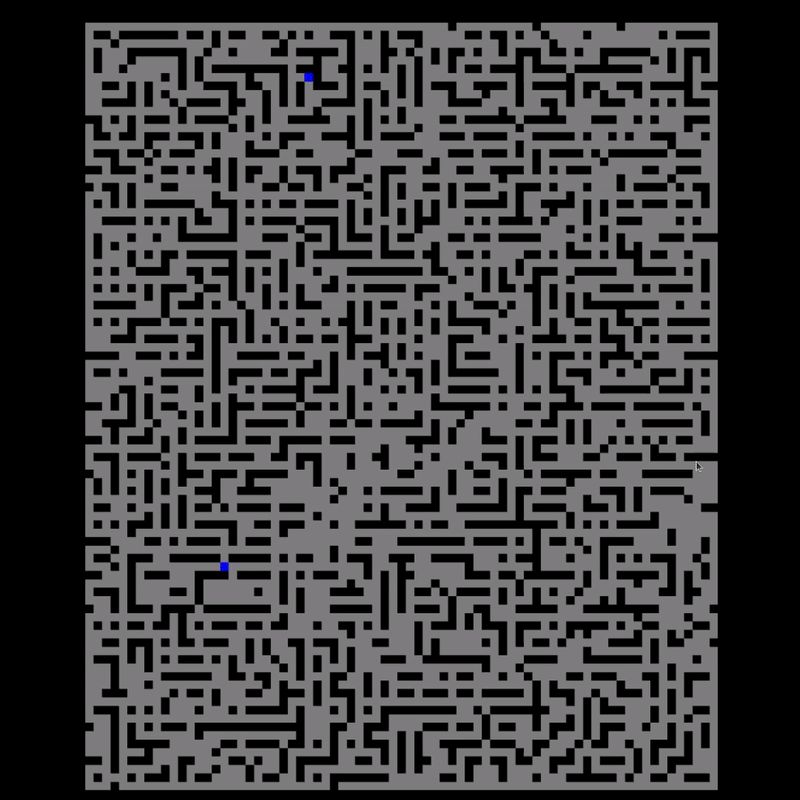
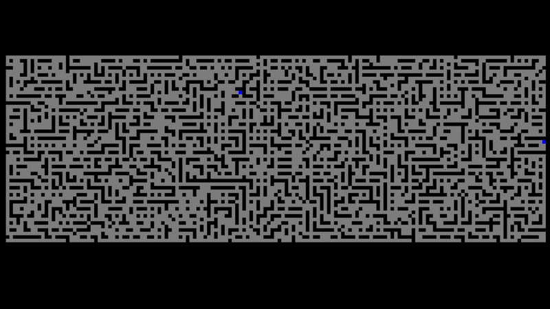

# Graph/Maze Visualisation Program

## Overview
This program visualises graphs/mazes in 2D and applies various pathfinding algorithms
to find path between to poins. The following algorithms are supported:
- **BFS** (Bread-First-Search)
- **DFS** (Depth-First-Search)
- **A*** (A-Star)
- **Greedy Search**
- **Random Search**

## Showcase
<div style="display: flex;">
    
    
</div>

## Features
- **Graph Parsing:** The program can read and parse graphs from a text file
- **Pathfinding algorithms:** Allows the selection of different algorithms to find path in the graph
- **2D Visualisation:** Visualisation of the graph and all visited and opened vertices as well as the 
path that was found
- **Interactive controls:** You can control the visualisation with the following features:
    - **Adjust speed**: Change the speed of visualisation to match your preference
    - **Pause/Resume:** Pause the visualisation at any time
    - **Algorithm Change:** Simply switch between different algorithms
    - **Reset/Loop:** Reset or loop the visualisation 

## Requirements
- You need to install the SFML library (SFML DEV) to build and run the program
  https://www.sfml-dev.org/download/ 
- After installing SFML, you may need to change the library path in Makefile accordingly (change the SFML_INCLUDE and SFML_LIB)

## Run the program
- Use **make** build the program
- run program using **./main arg1 arg2 \<arg3\>**
    - **arg1 )** Pathfinding algorithm type, options: bfs, dfs, astar, greedy, random
    - **arg2 )** Relative path to the text file containing the graph 
    - **arg3 )** Visualisation speed (1-100), optional argument

## Graph Text File format
- The graphs needs to be in the following format so it can be parsed properly:
    - Each line of the file must consist of only following symbols:
    -  `X` stands for Wall
    - A space ` ` stands for Empty Space
    - `T` stands for Wall of a different colour (Tree)
- Create graph in this format so that each line contains only these symbols
- At the end of the file include: 
    - New line that has format `start x, y`, where `x` and ``y`` and coordinates for starting position (need to be valid in your graph)
    - New line that has format `end x, y`, where `x` and ``y`` and coordinates for ending position (need to be valid in your graph)
- Here is and example of such format:
```
XXXX
X  X
XXXX
start 1,1
end 1,1
```

## Controls
- **Visualisation Speed:** Use `a` to slow down and `d` to speed up the visualisation
- **Pause/Play:** Use `spacebar` to pause and play the visualisation
- **Restart:** Use `r` to restart the visualisation
- **Algorithm Change:** Use `s` to switch between algorithms
- **Loop:** Use `l` to loop the visualisation
- **Show path:** Use `f` to show only the path without all the steps
- **Visualisation Style:** Use `c` to change visualisation Style
- **(Experimental) Speed Control using different method:** Use `q` to visualise less steps in one frame and `e` to visualise more steps in one frame
